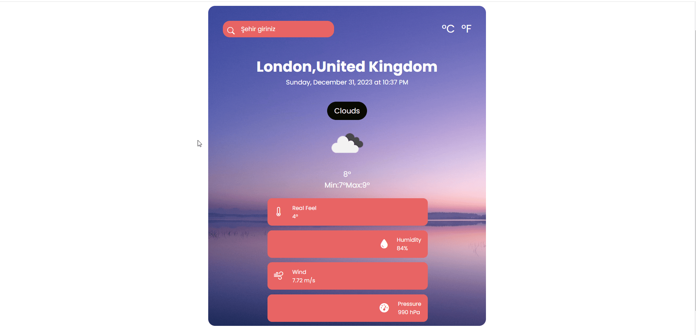

This Weather App was prepared with RESPONSIVE design.
It is an application that provides weather information based on the user's current or selected location.

Project Overview:

HTML5, CSS and JS codes were used in the RESPONSIVE WEBSITE prepared using the Boostrap library.

OpenWeather;
It offers developers access to weather data via API. In addition to providing real-time weather information, this API can also include long-range forecasts, temperature, pressure, wind, precipitation and other meteorological data.

It is an application that provides weather information based on the user's current or selected location.
`fetch` : A request is sent to the OpenWeather API. Sends a GET request to the specified URL with the fetch() method. The then() method receives the response from the server and processes the response. If an unsuccessful response is received from the server, the catch() method catches the error.

 External Library:
Boostrap,
Fontawesome

<h1>WEATHER-APP</h1>

 This project is a website designed using advanced HTML and CSS and Javascript codes. 

<h3>How to Use</h3>
-Weather App is a mobile application that allows users to access instant weather information based on their location. This application retrieves weather data using the OpenWeather API and presents it in a user-friendly interface.
1. Download or clone the project files.
2. Open the `index.html` file in a web browser to view the website.

<h3>Features</h3>

- A modern design created with advanced HTML 5, CSS ve Js codes.
- Responsiveness 
- Enriched content with Boostrap icons.
If you have any questions or suggestions, feel free to contact me at [gkarakaya0601@gmail.com](mailto:email@example.com).

